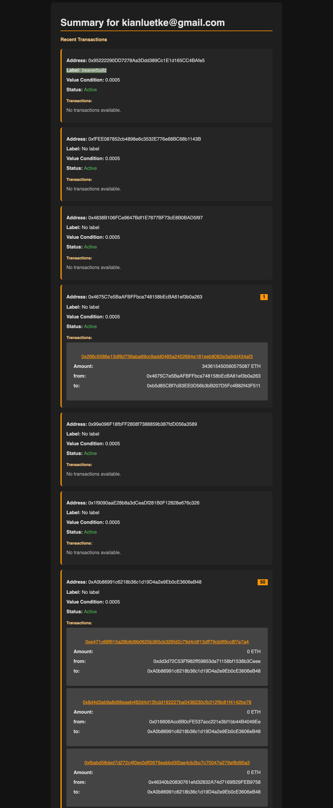
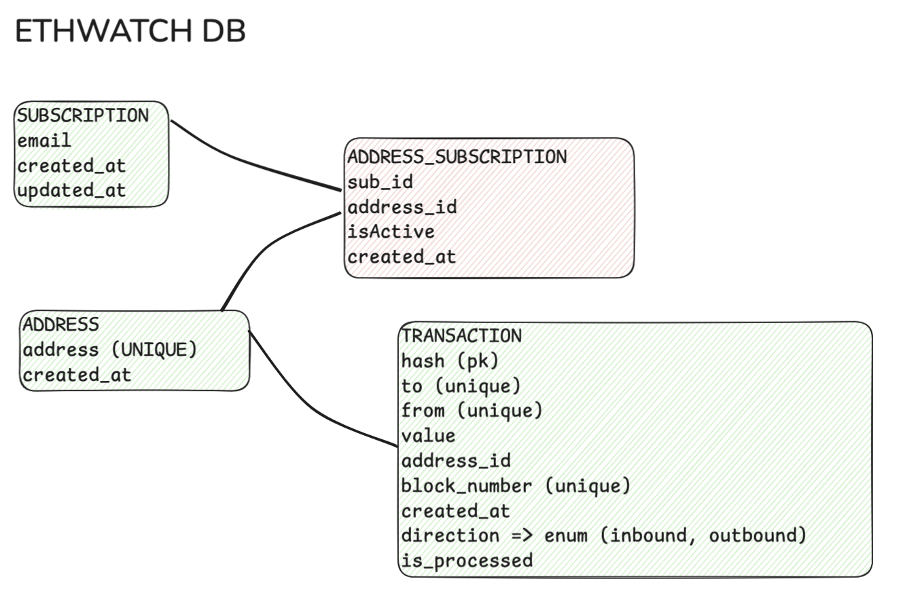

# ETHWATCH Backend with bun and hono

This is a simple backend service to watch for transactions on the Ethereum Blockchain. It uses the `bun`, `drizzle` ORM and `hono` web framework. Later it will be part of a larger project to watch for transactions and notify users via email.



## Database Design



## Setup

Run the Database:
```sh
docker-compose up -d
```

Install dependencies:
```sh
bun install
```

Generate and run the migrations:
```sh
bun run db:generate
bun run db:migrate
```

And start the dev server:
```sh
bun run dev
```


## Usage

To subscribe to ETH Address:
```
POST localhost:3000/subscriptions
{
    "email": "kianluetke@gmail.com",
    "address": "0xdAC17F958D2ee523a2206206994597C13D831ec7",
    "valueCondition": 0.05 // optional in ETH (for minimum value)
}
```

Watch the logs to see the updates :) new Addresses will be automatically added to the watchlist in 1 Minute intervals by the `watcher` service.


To check a summary of current tracked txs open the browser and navigate to:

[http://localhost:3000/summary](http://localhost:3000/summary)


> This is how the a quick draw for the email. The email service is not implemented yet.

